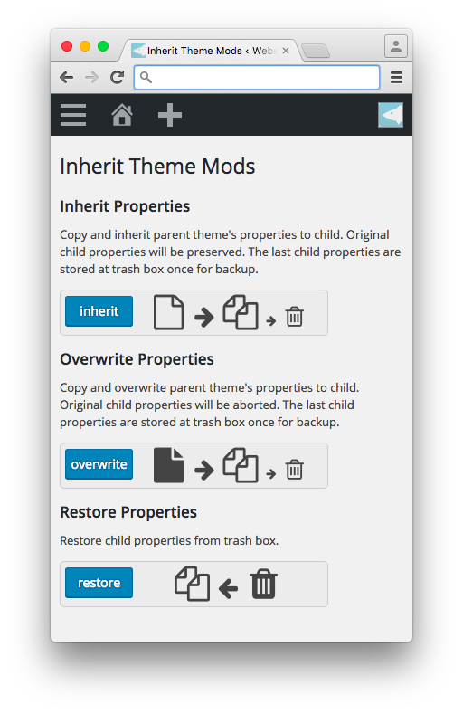
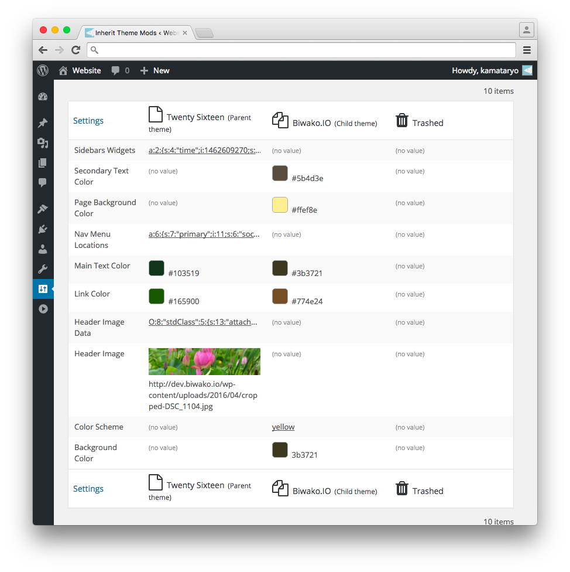

# Inherit Theme Mods

[https://wordpress.org/plugins/inherit-theme-mods/](https://wordpress.org/plugins/inherit-theme-mods/)

WordPress plugin 'Inherit Theme Mods' enable to copy child theme properties from those of parent. You can see details on [official plugin directory](https://wordpress.org/plugins/inherit-theme-mods/).

## License
GPLv2 or later

License URI: http://www.gnu.org/licenses/gpl-2.0.html

## screenshots

- you can see 'Inherit Theme Mods' in 'settigns' menu

- inherit or overwrite parental property to that of child.

- You can use 'Inherit Theme Mods' as simple inspector for theme properties.

