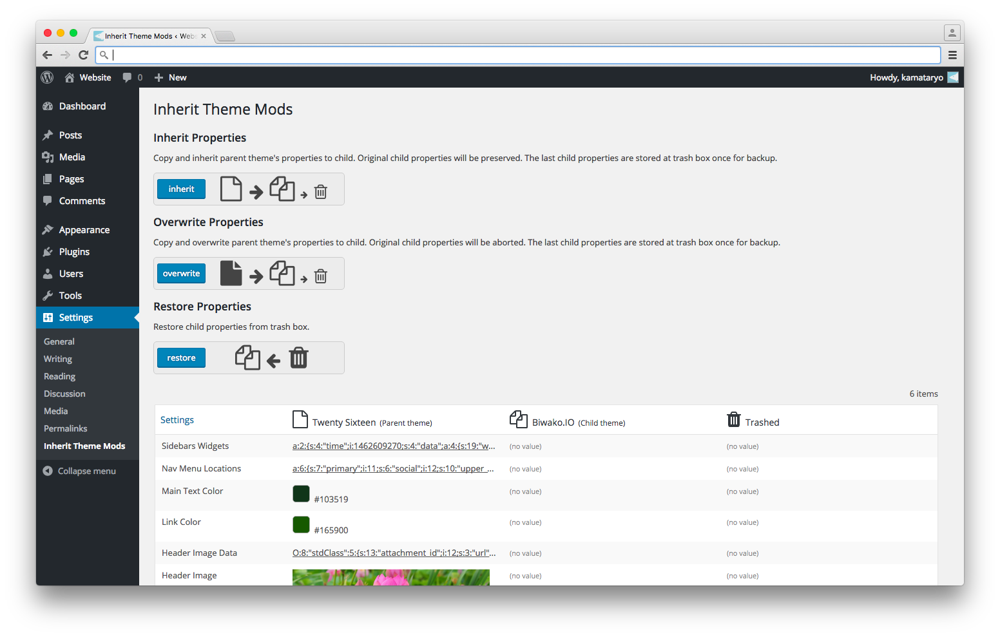

# Inherit theme mods

WordPress plugin 'Inherit Theme Mods' enable to copy child theme properties from those of parent.

License: GPLv2 or later
License URI: http://www.gnu.org/licenses/gpl-2.0.html

## screenshots

- you can see 'Inherit Theme Mods' in 'settigns' menu

- inherit or overwrite parental property to that of child.

- You can use 'Inherit Theme Mods' as simple inspector for theme properties.

